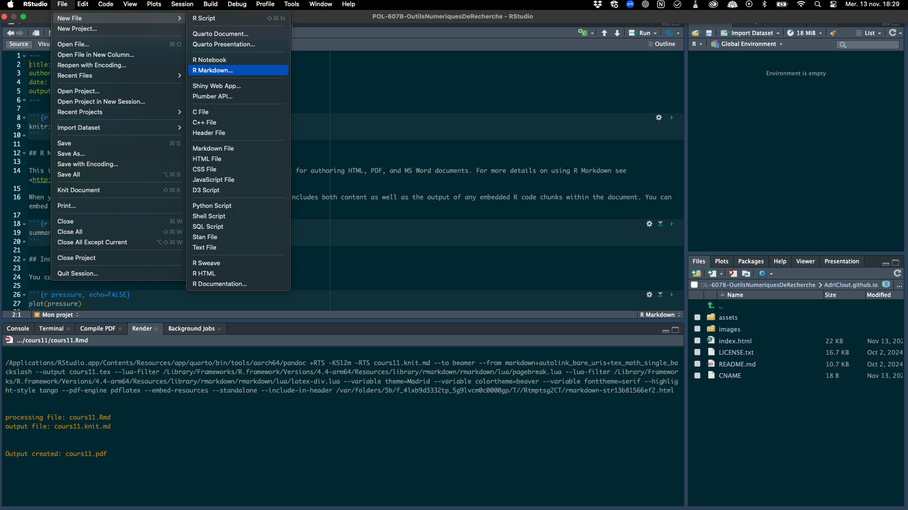
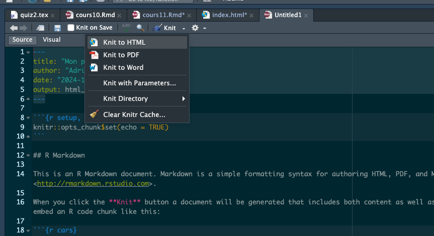
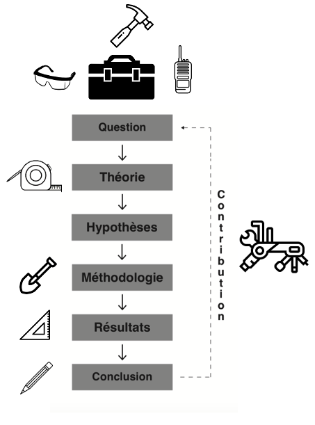

Bravo pour la première itération de votre site web ! Dans cette deuxième itération, vous allez enrichir votre site avec un CV en format PDF, ajouter une nouvelle section pour héberger vos projets et y déposer déjà un premier projet. Suivez les étapes ci-dessous pour intégrer ces nouveaux éléments.

## Étape 1 : Créer un CV et l'ajouter à votre site

1. **Choisissez un gabarit de CV en LaTeX** : [Overleaf](https://fr.overleaf.com/gallery/tagged/cv) présente de nombreux gabarits et est simple d'utilisation, mais vous pouvez fouiller ailleurs sans problème.

2. **Complétez votre CV** : Remplissez le gabarit avec vos informations. Assurez-vous que votre CV est complet et bien présenté.

3. **Enregistrez votre CV en PDF** : Une fois terminé, exportez votre CV en format PDF.

4. **Ajoutez le code source et le PDF de votre CV à votre répertoire GitHub** :
   - Créez un dossier nommé `cv` à la racine de votre répertoire GitHub.
   - Placez-y votre fichier LaTeX.
   - Placez également votre CV en PDF dans ce dossier.
   - Prenez une capture d'écran de la première page de votre CV et enregistrez-la dans le même dossier `cv`, sous le nom `cv.png`.

## Étape 2 : Intégrer un lien vers le CV en PDF et afficher un aperçu dans la section «Mon CV»

1. **Modifiez la section «Mon CV» dans le code HTML** :
   - Dans votre fichier `index.html`, localisez la section `three`, qui commence par :

     ```html
     <!-- Three -->
     <section id="three">
     ```

2. **Ajoutez le lien vers le CV et l'image d'aperçu** :
   - Remplacez le contenu de cette section avec les modifications ci-dessous pour intégrer le lien vers le CV PDF ainsi que l'aperçu de l'image.

   ```html
   <!-- Three -->
   <section id="three">
     <div class="container">
       <h3>Mon CV</h3>
       <p>
         Vous trouverez ci-dessous un aperçu de mon CV. Cliquez sur l'image ou le bouton pour consulter le document complet en format PDF.
       </p>
       <div class="features">
         <article>
           <!-- Aperçu du CV en image -->
           <a href="cv/cv.pdf" class="image" target="_blank">
             
           </a>
           <div class="inner">
             <h4>Consultez mon CV</h4>
             <p>
               Cliquez sur l'image ci-dessus ou sur le lien ci-dessous pour ouvrir mon CV en PDF dans un nouvel onglet.
             </p>
             <!-- Lien direct vers le CV en PDF -->
             <p>
               <a href="cv/cv.pdf" target="_blank" class="button primary">
                 Voir le CV en PDF
               </a>
             </p>
           </div>
         </article>
       </div>
     </div>
   </section>
   ```

3. **Vérifiez l'affichage de votre site** :
   - Enregistrez les modifications et poussez-les sur GitHub.
   - Accédez à votre site et allez à la section «Mon CV» pour vérifier que l'image s'affiche correctement et que les liens vers le CV en PDF fonctionnent.

---

## Étape 3 : Ajouter une section «Mes Projets» et intégrer un projet de session

Après la section «Mon CV», nous allons ajouter une nouvelle section nommée «Mes Projets». Notez que dans le code initial, il y a seulement 4 sections : «À propos», «Mon travail», «Mon CV», et «Me joindre». Vous devrez donc insérer cette cinquième section **entre «Mon CV» et «Me joindre»**.

### Créer la section «Mes Projets» dans le code HTML

1. **Ajoutez un onglet «Mes Projets»** dans le menu de navigation :
   - Dans votre fichier `index.html`, localisez la section de navigation :

     ```html
      <nav id="nav">
        <ul>
          <li><a href="#one" class="active">À propos</a></li>
          <li><a href="#two">Mon travail</a></li>
          <li><a href="#three">Mon CV</a></li>
          <li><a href="#four">Contact</a></li>
        </ul>
      </nav>
     ```

   - Ajoutez entre `three` et  `four` le lien vers cette nouvelle section en insérant le code suivant :

     ```html
     <li><a href="#projets">Mes Projets</a></li>
     ```

2. **Insérez la section «Mes Projets» dans le code HTML** :
   - Placez cette section après les sections entre `three` et  `four` de votre fichier `index.html`, de façon à ce qu'elle apparaisse avant «Me joindre».

   ```html
   <!-- Mes projets -->
   <section id="projets">
     <div class="container">
       <h3>Mes Projets</h3>
       <p>
         Voici une sélection de mes projets. Cliquez sur l'image pour découvrir le projet complet.
       </p>
       <div class="features">
         <article>
           <!-- Aperçu du projet en image -->
           <a href="projet_session/projet.html" class="image" target="_blank">
             
           </a>
           <div class="inner">
             <h4>Cours d'outils numériques (POL-6078)</h4>
             <p>
               Cliquez sur l'image ou sur le lien ci-dessous pour explorer le contenu de ce projet.
             </p>
             <!-- Lien direct vers le projet -->
             <p>
               <a href="projet_session/projet.html" target="_blank" class="button primary">
                 Voir le projet complet
               </a>
             </p>
           </div>
         </article>
       </div>
     </div>
   </section>
   ```

### Préparer le document R Markdown

1. **Créez un dossier nommé `projet_session`** dans votre répertoire GitHub :
   - Ce dossier contiendra le fichier R Markdown et les ressources associées à votre projet de session.

2. **Dans le dossier `projet_session`, enregistrer un fichier R Markdown nommé `projet.Rmd`**
   - Vous pouvez utiliser un gabarit R Markdown trouvé en ligne ou démarrer d'une page blanche via RStudio.
   - Pour créer une fichier R Markdown sur RStudio, cliquez sur «Files», «New File», puis «R Markdown...»



3. **Exportez le fichier R Markdown en HTML** :
   - Vous pouvez vider le contenu par défaut de cette page, ou conserver l'en-tête, au choix.
   - L'important sera d'exporter le résultat (on dit « knit », en langage Markdown) en format html et de l'enregistrer dans votre dossier `projet_session`
   - Une fois le fichier `projet.md` complété, exportez-le en HTML et nommez ce fichier `projet.html`.
   - Prenez une capture d'écran de votre projet (ou une image trouvée sur le Web, au choix) et placez l'image d'aperçu du projet dans le même dossier `projet_session` et nommez-la `projet.png`.



4. **Vérifiez l'affichage de votre site** :
   - Enregistrez et poussez vos modifications sur GitHub.
   - Allez à la section « Mes Projets » pour vérifier que l'image d'aperçu est bien affichée et que le lien mène au contenu du projet en HTML.

### Remplir le document R Markdown

Dans cette étape, vous allez réaliser un court projet de session dans votre page HTML de projet (écrite en R Markdown) qui démontrera votre capacité à utiliser différents outils de recherche tout au long du cycle de la recherche, tel que représenté dans l'image du cycle de recherche hypothético-déductif issue de la méthode scientifique.

En fonction des étapes indiquées dans l'image et vues en classe, suivez les consignes ci-dessous pour structurer votre projet de session.



#### Étapes du projet

1. **Question de recherche et hypothèse** :
   - Posez une question de recherche.
   - Effectuez une brève revue de la littérature scientifique pour dériver une hypothèse de recherche en lien avec votre question.
   - **Indiquez les outils utilisés** pour cette étape (ex. Google Scholar, Zotero, Elicit, etc.) et détaillez pourquoi et comment vous les avez utilisés (par exemple, pour trouver des articles, organiser des sources, etc.).

2. **Collecte de données** :
   - Choisissez un outil pour collecter des données en lien avec votre hypothèse (ex. Factiva, Eureka, un questionnaire en ligne, une base de données en libre accès, etc., des données extraites du Web, etc.).
   - **Présentez l'outil choisi** et expliquez en détail comment vous l'avez utilisé pour collecter vos données.

3. **Analyse et visualisation des données** :
   - Utilisez un outil pour analyser et/ou visualiser les données que vous avez collectées (ex. Excel, R, Python, Tableau, etc.).
   - **Détaillez l'outil utilisé** et expliquez comment vous vous en êtes servi pour produire des résultats ou des visualisations.

4. **Discussion** :
   - Ajoutez une section de discussion à la fin de votre projet.
   - Dans cette discussion, expliquez vos choix d'outils en fonction **des valeurs, de la philosophie ou des besoins** qui ont guidé vos décisions.
   -  Basez-vous, entre autres, sur les critères de sélection des outils vus en classe: l'accessibilité, l'existence d'une communauté d'utilisateurs, la popularité dans votre domaine, leur compatibilité avec d'autres outils, le besoin de transparence et la réplicabilité, et la capacité d'adaptabilité et de flexibilité des outils.

#### Important

Il n'y a pas de bonne ou mauvaise réponse pour ce travail. L'objectif est de démontrer votre capacité à utiliser des outils numériques de recherche tout au long d'un processus de recherche, de la réflexion sur une question jusqu'à la présentation des résultats. Ce travail doit refléter votre compréhension et votre maîtrise des outils ainsi que la manière dont vous les avez intégrés dans le cycle de la recherche.

### Ajoutez tous les fichiers pertinents à votre répertoire GitHub

Votre dossier `projet_session` devrait contenir un dossier `code` à l'intérieur duquel se retrouvent les codes R (si vous utilisez cet outil, par exemple) créés pour l'analyse et la visualisation de données. Il pourrait y avoir également un dossier `data`, dans lequel se retrouvent les données collectées, et un dossier `images` dans lequel se trouvent vos graphiques et vos visualisations. Peu importe les outils choisis, assurez-vous que tout le contenu pertinent à l'évaluation de votre travail se retrouve dans le dossier `projet_session` de votre repo GitHub.

---

Une fois le projet complété, assurez-vous de bien respecter la structure décrite ci-dessus pour que chaque étape du cycle de recherche soit clairement identifiable dans votre document.

Bien joué!

---

### Critères d'évaluation de la 2e itération

**1. Site Web sur GitHub (20%)**
   - Le site web est hébergé correctement sur GitHub, et le répertoire est accessible.
   - Les commits sont visibles et montrent un suivi régulier du travail effectué.
   - Les fichiers (PDF, images, fichier markdown, HTML du projet) sont bien organisés dans les dossiers indiqués (`cv`, `projet_session`).

**2. Respect des consignes et des étapes (30%)**
   - L'étudiant.e a suivi toutes les étapes du ReadMe.
   - Les nouvelles sections «Mon CV» et «Mes Projets» sont présentes et complétées correctement.
   - Le lien vers le CV en PDF fonctionne, et l'aperçu du CV s'affiche bien dans la section «Mon CV».
   - La section «Mes Projets» contient une image cliquable qui mène au fichier HTML du projet de session.
   - La page HTML du projet de session respecte la structure demandée, avec chaque étape du cycle de recherche clairement identifiable.

**3. Qualité et clarté du contenu de recherche (40%)**
   - La question de recherche, l'hypothèse, la collecte de données, l'analyse et la discussion sont clairs et pertinents.
   - L'étudiant.e décrit de manière détaillée les outils utilisés à chaque étape et la manière dont ils ont été appliqués.
   - La visualisation de données est intéressante, pertinente et bien réalisée.
   - La discussion sur les choix d'outils montre une réflexion personnelle et justifie les choix par rapport aux valeurs ou à la philosophie de recherche.

**4. Créativité et personnalisation (10%)**
   - L'étudiant.e a pris des initiatives pour personnaliser son site au-delà des consignes de base, par exemple :
     - Amélioration du design ou des couleurs du site.
     - Choix d'un style ou d'une mise en page unique pour le projet de session.
     - Utilisation avancée de markdown ou d'éléments visuels pour enrichir la présentation du projet.
